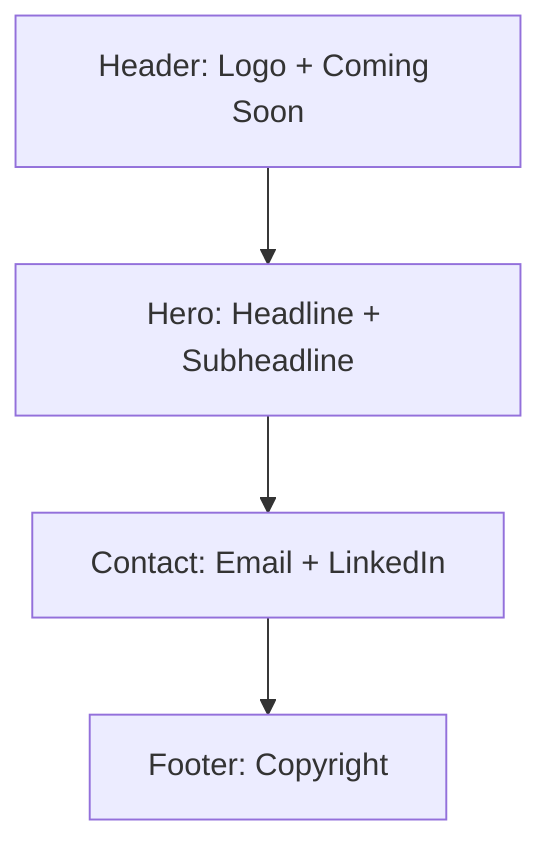

# Pattern Agentic Placeholder Site Plan

## ✅ Objective

Generate a simple, professional, and lightweight HTML/CSS website for **Pattern Agentic**. This site will serve as a placeholder before the full launch.

## ⚙️ Technical Details

- Uses HTML + CSS (no heavy frameworks like React)
- Minimalist TailwindCSS for styling (or lightweight CSS for flexibility)
- Includes the existing logo (`img/logo.png`)
- Fast-loading, responsive layout (no unnecessary animations or scripts)
- Must be easy to edit for future updates

## 🗂️ File Structure

```
pattern-agentic/
├── index.html
├── style.css
├── img/
│   └── logo.png
└── CNAME (optional, for custom domain)
```

## 🧱 HTML Structure (`index.html`)

```html
<!DOCTYPE html>
<html lang="en">
  <head>
    <!-- Meta + Title + Fonts + Tailwind CDN -->
  </head>
  <body>
    <header>
      <!-- Logo + Coming Soon -->
    </header>
    <main>
      <!-- Hero Section -->
    </main>
    <footer>
      <!-- Contact + Copyright -->
    </footer>
  </body>
</html>
```

## 🎨 Styling Approach

- TailwindCSS CDN for utility-first styling (no build step)
- Responsive layout using Tailwind’s grid/flex utilities
- Color palette: deep blue background, neon green accents
- Font: Google Fonts (e.g., Inter or Lexend)

## 📱 Responsive Design

- Mobile-first layout
- Centered content with generous spacing
- Scales well from phones to desktops

## 🔗 Contact Section

- `mailto:` link for email
- Optional LinkedIn button styled as a clean pill-shaped button

## 🌐 GitHub Pages Ready

- Fully static
- Uses relative paths (`img/logo.png`)
- Optional `CNAME` file for custom domain (e.g., `patternagentic.ai`)

## 🧩 Optional Enhancements

- Subtle background gradient or texture
- Hover effects on buttons
- Favicon (if provided)

## 🗺️ Mermaid Diagram: Site Layout



## 📝 Content Details

### Header
- Displays the logo (`img/logo.png`)
- Simple centered layout
- Dark or light theme (best contrast)

### Hero Section
- **Main headline:**  
  `Pattern Agentic`  
  *(Uses a bold, modern font.)*
- **Subheadline:**  
  `"AI Workforce Execution for the Next Era of Automation"`
- **"Coming Soon" notice**

### Contact Section
- Email link: `hello@patternagentic.ai`
- Optional LinkedIn button: `https://linkedin.com/in/james-wilson-eng`
- Clean button UI (no forms)

### Footer
- `"© 2025 Pattern Agentic. All Rights Reserved."`

## 🧭 Style Guidelines

- Minimalist, modern, and tech-focused
- Primary Colors: Deep blue & neon green (or AI-style neutral tones)
- Fonts: Clean, sans-serif (Montserrat, Poppins, Lexend, or Inter)
- Layout: Fully responsive for desktop & mobile
- Background: Solid or subtle gradient
- Padding/Margins: Spacious for a premium feel